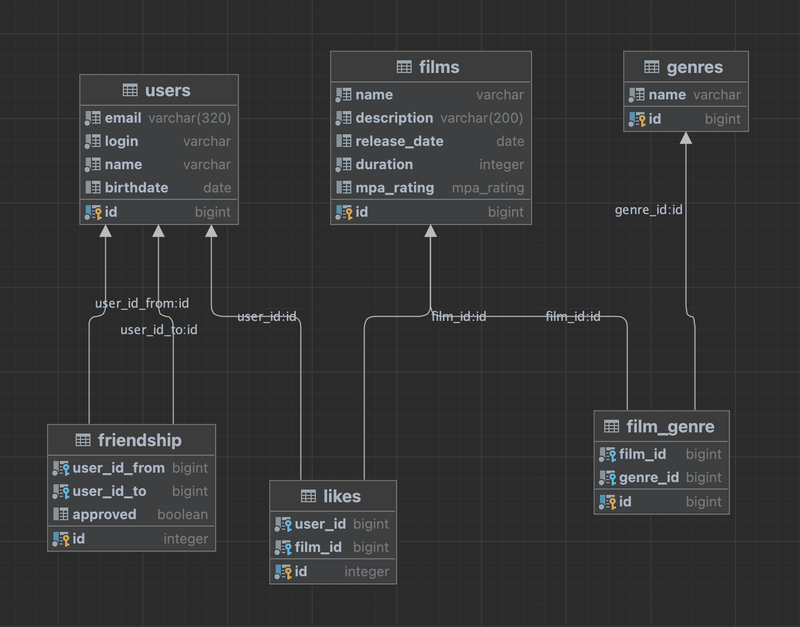

# java-filmorate
### Примеры SQL-запросов для описанной схемы данных

#### Пользователь:
```
SELECT * FROM users WHERE user_id=1;
```

#### Лайки пользователя
```
SELECT * FROM likes where user_id=1
```

#### Друзья пользователя:
```
SELECT user_id_from as comb FROM friendship where user_id_to=1 and approved = TRUE
UNION ALL
SELECT user_id_to as comb from friendship where user_id_from=1 and approved = TRUE
```

#### Жанр фильма

```
SELECT genre_id from film_genre WHERE film_id=1
```


ER-диаграмма
